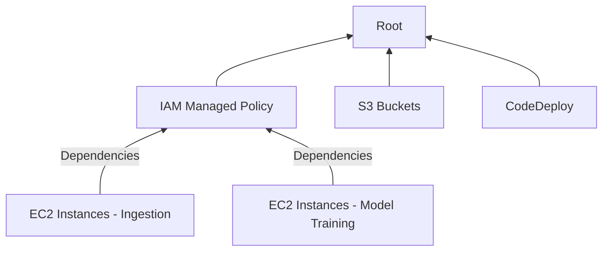

# Nested Stack Architecture

```mermaid
flowchart BT
%% Nodes
    stack_root["Root"]
    stack_iam["IAM Managed Policy"]
    stack_s3["S3 Buckets"]
    stack_ec2_ingestion["EC2 Instances - Ingestion"]
    stack_ec2_model_training["EC2 Instances - Model Training"]
    stack_codedeploy["CodeDeploy"]
%% Links
    stack_iam -->stack_root
    stack_s3 --> stack_root
    stack_codedeploy --> stack_root
    stack_ec2_ingestion -- Dependencies --> stack_iam
    stack_ec2_model_training -- Dependencies --> stack_iam
```